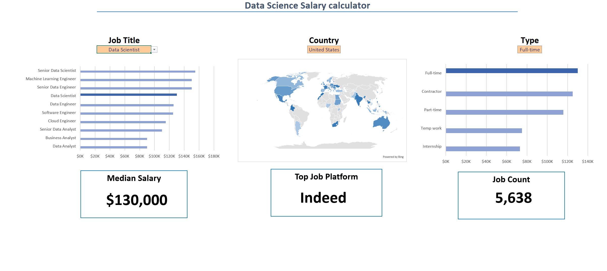

e# Excel_Project_Analytics
 
# Excel Salary Dashboard

  


## 📊 Overview

The **Data Jobs Salary Dashboard** is designed to assist job seekers in evaluating salaries for various roles, helping them determine fair compensation. 

The dataset originates from my **Excel course**, which emphasizes mastering Excel for data analysis. It includes job titles, salaries, locations, and required skills, all presented through insightful visualizations.

---

## 📁 Dashboard File

- Download the dashboard: **[Salary_Dashboard.xlsx](project)**  
- Screenshot preview:  
 


---

## 🛠️ Excel Skills Demonstrated

This project highlights the following Excel functionalities:

- 📉 **Charts**  
- 🧮 **Formulas and Functions**  
- ❎ **Data Validation**  

---

## 📁 Dataset Details

The project leverages a dataset featuring real-world data science job statistics from **2023**.  
Key attributes include:

- 👨‍💼 **Job Titles**  
- 💰 **Salaries**  
- 📍 **Locations**  
- 🛠️ **Required Skills**

---

## 🛠️ Dashboard Components

### 📉 Visualizations

#### **Bar Chart: Data Science Job Salaries**

- **Features**: Used Excel’s bar chart to visually compare median salaries.  
- **Design**: Horizontal layout for improved clarity.  
- **Organization**: Sorted job titles in descending order of salary.  
- **Takeaway**: Senior positions and engineering roles tend to offer higher salaries than analyst roles.

#### **Map Chart: Country Median Salaries**

- **Features**: Utilized Excel’s map chart to display median salaries geographically.  
- **Design**: Color-coded regions to highlight salary differences across countries.  
- **Takeaway**: Easily identifies regions with higher or lower salary ranges.

---

### 🧮 Formulas and Functions

#### **Median Salary Calculation**

```excel
=MEDIAN(
IF(
    (jobs[job_title_short]=A2)*
    (jobs[job_country]=country)*
    (ISNUMBER(SEARCH(type,jobs[job_schedule_type])))* 
    (jobs[salary_year_avg]<>0),
    jobs[salary_year_avg]
)
)
```
- **Purpose**: Computes median salary for selected job titles, locations, and work types.
- **Key Features**: Multi-condition filtering and array-based formula for tailored results.
 #### **Job Schedule Type Count**
 ```excel
=FILTER(J2#,(NOT(ISNUMBER(SEARCH("and",J2#))+ISNUMBER(SEARCH(",",J2#))))*(J2#<>0))
```
**Purpose**: Creates a unique list of valid job schedule types while filtering out invalid or duplicate entries.
**Usage**: Populates the background table, ensuring accurate input data.


### ❎ Data Validation

Functionality: Implemented data validation rules to restrict user inputs to pre-approved job schedule types.

**Benefits:**

🚫 **Reduces errors and inconsistencies.**

🎯 **Improves data integrity.**

👥 **Enhances overall usability of the dashboard.**


### 📊 Conclusion
This Excel Salary Dashboard provides valuable insights into salary trends for various data-related job roles. By leveraging data from my Excel course, it equips users with the tools to make informed career decisions, exploring the influence of job titles, locations, and work types on salaries.

Feel free to explore, adapt, and utilize this project for your own data analysis needs!
